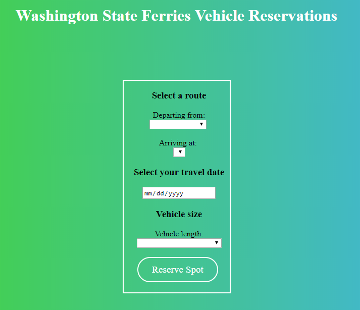
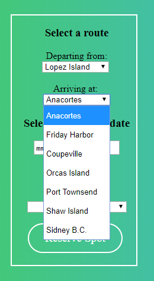

# Washington Ferry Ticket Reservation

Above is the starting page of the app.

This application is for reserving a vehicle spot on a Washington State Ferry. I made the app with HTML, CSS, JavaScript and PHP.

Below are the options for destinations. As shown, the arrival options exclude the option chosen by the user for departure city.

I used JavaScript to make changes to the web page (without reloading) based on the user's selections, like with the arrival options. 

The Vehicle length has 3 options: under 22 feet, 22 feet and over, or motorcycle. The form items in the area below will change based on what the user selects. For example, if the user selects "22 feet and over", a new box will appear asking for the length in feet - as shown below.

If the user selects motorcycle, 2 checkboxes will come up asking the user some additional questions - see below.

This was what I used JavaScript for.

Finally, after clicking on "Reserve Spot", if you have entered all of the information, you will be brought to a confirmation page. The information entered on the previous webpage is retrieved via an HTTP GET request using PHP.

